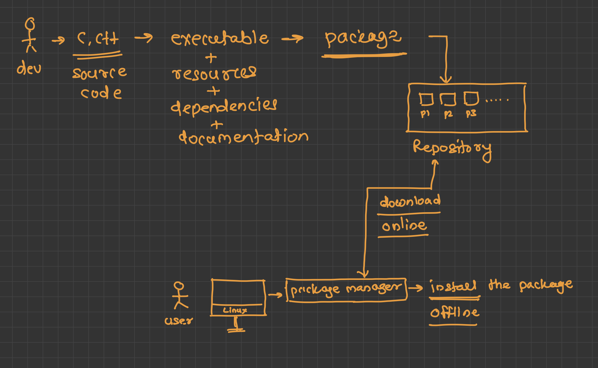

# Deployable Installation

When you say deployable package, which means installable applications. For different application there are different deployable package, thus different formats are defined for Operating System, it could be Windows, MacOS, Linux, all of them has its own package executable format.

- Windows uses the **.exec** format.
- Linux uses the **.rpm** for RHEL (RedHat Linux), which is Red Hat Package Manager and **.deb** for debian based Linix.
- MacOS uses the **.dmg** file format, it stands for Disk Image. 
- Similarly, for Android it is **.apk**, meaning Android Application and **.aab**.
- For iOS is **.ipa** (iPhone Application).


The one who manages, installs, updates, and remove the packages is called the Package Manager. Package Manager should be able to do certain things:

- Package managers track software installation information in a database that can be queried.
- Such queries might include a list of all installed software, a list of software versions, or specific information on a single software
package
- The ability to query the package manager's installation database provides sysadmins with essential information on the system and its application.

All these packages files formats contains **pre-defined** binaries, **configuration** files, **shared resources** and some kind of Documentation. All these files are used to install the packages, basically they are softwares that have an executable file within the package file and these contains bunch of information of the Operating system version and other resources. But Basically there are two ways to install the package.

- **Offline** Method. It uses **rpm** (In RHEL) and **dpkg** (In Ubuntu or Debian based Linux) which can be installed without internet using the .rpm or .deb file already present within the system, meaning either it should be present locally on the server, or it should present within the system. You need install using the exact location of the .rpm or .deb file, becuase the rpm won't search for the file within the system.

| |Offline |Online |GUI |
|-|--------|-------|----|
|RHEL (Red Hat Enterprise Linux)|**rpm**| **yum**/**dnf**| - |
|Debian-based Linux|**dpkg**| **apt-get**/**aptitude**| Synaptic |
|SuSE|**zypper**| **zypper**| YaST |

- **Online** Method. It uses **yum** or **dnf**, though, behind the scene it uses **Offline** method only. The file is taken or is downloaded using the internet and therefore it can be time consuming and slow. Because, yum or dnf is only a package manager all the database is carried out by rpm only. Unlike rpm (for Red Hat) and dpkg (for debian based distros) they manages the dependencies and install them when they are not found, so the installation goes smooth even if the dependencies are not present. 



But remember that rpm is like the ultimate god, behin the scene it is rpm that is maintaining its own database and therefore if you need to check if the package is installed or not, you need to use rpm (in Red Hat) and dpkg (in other debian based distros).

```
rpm -q package-name
```

When it comes to yum or dnf, they just manages, updates, and remove the packages, the real one behind is the rpm (for Red Hat) and dpkg (for Debian based). Because when you do `yum install package-name`, it start installing the package from the remote repository and after downloading the repo, it is the rpm or dpkg which will start unpacking the package. 

Because of the open-source nature of the Linux, the distribution is shared using the source-code [Difference between the Linux and Mac operating system](../concepts/difference-linux-macOS.md) to learn more about how the **world of linux** works.

# Packages and Package Management

Packages are the deployable or installable application that are installed into the system. All the packages that we install do have certain things such as executable **binaries**, configuration files, shared resources, and documentation. 

Another important part is from where you are installing the packages. The Storage location where the packages are stored is referred as **Repository**. A Repository can contain number of packages depending on the sysadmins. Now the packages can be installed in number of way:

- Through the internal server. Internal server could be a server that lies within the private premises of your organisation's network.
- Using the Distribution Vendor. It could the Linux Distros, like RHEL (Red Hat Enterprise Linux) or Ubuntu.
- Through Public Packages. 

If we talk about the Distribution Vendor, they manage the Software Development Lifecycle of the packages in their own way, someitmes, there can be changes that you didn't wanted and yet they got updated when you updated the packages using the package manager. 

So there are few advantages with few disadvantages of using the package manager. When using Package Manager you get all the installed dependencies, though it is good practise to install the dependencies before you isntall the primary package, but the modern package manager, such as YUM, DNF, and APT would do the job on its own. 

# RPM commands

RPM is the legacy method of installing the packages, though it is not as efficient as the **yum** and **dnf**. These RPM files are pre-compiled files and **rpm** is used to install the RPM file with .rpm extension and therfore if the dependencies are not taken care the installation can be corrupted. The idea is simple, a single package contains all the files necessary for the installation of the packages.

When you say `yum install package-name`, it means it will install all the packages dependencies then it will install all the packages.

### `rpm -ivh package-name.rpm`

This is used to install the new package with three options, **i** means to install the package, **v** means the verbose (keep updating the process using the messages), then **h** means to progress using the hash masks.

### `rpm -Uvh package-name.rpm`

This means to upgrade the package, if the package doesn't exist, update it.

### `rpm -qf /file/path`

This is useful to find out the **package name** for the file, when you can't find out what is the name of the package of the given file, then you could use this command.

### `rpm -ql package-name`

This is useful for listing all the files that are part of the package, thus you can list all the installed files for the package.

### `rpm -qc package-name`

It is to list all the configuration files that are installed for the package

### `rpm -qp --scripts package-name`

Displays pre-install, post-install, pre-uninstall, or post-uninstall scripts embedded in the RPM.

# How `yum` helps?

Use the below commands to search for the package you should use `yum search`, then there is `yum install`, `yum remove`, `yum update`, then there is `yum provide`, `yum info`, and `yum list`. 

# Repository

Repository contains the file necessary for the installation of the package, therefore, administrators should define centralized repositories of packages and configure the YUM and DNF package managers to use those repositories when installing or updating software. 

Now lets understand the where source of repositories come from, how they work, and how you can configure your own repositories.

### /etc/yum.repos.d/

It is a directory that stores all the repositories metadata that is used to install the packages.

# Boot Process

- Initially ther eis BIOS/UEFI, where you find your startup disk, 
- then it needs to find a bootable device, the first 512B it find s bootloader sequence
- It start the Bootloader comprising of GRUB and GPT
- then there is first user level process, literally the first process, which has given PID 1.
- Then, there is run level

### BIOS

Finding out the first booting device, it could be either BIOS or UEFI

### UEFI 

### Bootloader

4. THe bootloader is the small program that boots the whole program. 

Lets see the bigger picture of this. Think of the disk, that would have a **bootcode** on the top, then it has the bootable program, bootloader

### Run Level

- Run level 5 means that it will have the graphical interface, meaning after the booting process, it will boot to a graphical interface, the fedora server run level start with the 3, meaning no graphical interface. 

So it go to the in

The modern linux distros hava subsititue the new init process, called **systemd**.

# systemd

systemd is the first process that starts the running instnaces of services within the limux operating system. It is the last in the process of booting and hence it starts the services processes but doesn't start them, meaning it will initialise the process but they are managed using the **systemctl**.  

# Service Managment 

In the service managment and **systemd** is the first process that is used for adminitrative service management. When the OS is booted, it end with Run Level and it starts the services 

# Service and Deoman

Deomon doesn't ahve any GUI, do not provide any direct communication with the user and threfore they work in background. They don't intreact with user directly, though Services are interactive and therefore they have purpose behind the servers.

# systemd is Parent Proceess for all

**systemd** is like the parent, it starts when the system starts and end with the system shutdown.


# systemctl 

Check for the package using the following command:

```
rpm -p https
```

Rememeber if you need to start the service everytime the system boots, you need the service up and running and therefore you need to us the following command.

```
systemctl enable httpd
```

If you do **init 6**, on startup the systemd will automatically start the 

```
systemctl unit-list-files
```

The following command will reload all the serviecs running under systemd.

```
systemctl deomon-reload
```
How to see the newly added disk in Virtual Machine.

```
lsblk
```

# Modifying the System Configurations

