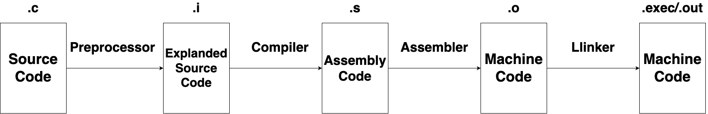

# `cd`

Use `cd` to change the directory from current directory **(pwd)** and `cd ..` to move to the previous directory or say parent directory. In case you need to go to the home directory use `cd ~` to move to home directory. You can also say that if `~` is by default argument with `cd`. You can also use `cd -` in to move the the previous working direcotry.

# `ls [OPTIONS]`

There are two kinds of directory, one is `.` , meaning hidden directory and another is `..`, which means that directory

Use `ls -a` to find the `.` and `..` files within the direcoty and `ls -A` will show all the direcotry ignoreing the `.` and `..` directories.

Use `ls -l` meaning it can list all the **10 types of information**

In **Linux**, there are 7 types of files and every file is expresses as following letters:

- **Regular** file - denoted by `-`
- **Directory** file - denoted as `d`
- **Link** file - denoted by `l`
- **Pipe** file - denoted by `p`
- **Socket** file - denoted by `s`
- **Character Speacial** file - denoted by `c`
- **Block Speacial** file - denoted by `b`


The data is when flowed **character-by-charater (Charater Speacial File)** then those device files are saved using `c` and sometimes the data flows **block-by-block (Block Speacial)** that is represented by `b`. You can see these files in the `dev` directory. Refer to [day1](day1/day1.md) to learn tree arch of linux.

- In `c` the data flows sequentially, meaning one character at a time, this can be seen in `/dev` dir that stores files of such types.
    ```
    ❯ cd /dev
    ❯ ls -la ttyw0
    crw-rw-rw-  1 root  wheel  0x4000070 Sep 28 04:19 ttyw0
    ```
- In case of `b` the data flow is in the block of data, meaning it could be pendrive or any storage device that has a contineous flow of data.
    ```
    ❯ ls -la disk0
    brw-r-----  1 root  operator  0x1000000 Sep 28 04:19 disk0
    ```

# `mkfifo`

It is used to create the pipe file, used as `mkfifo fifo` which is a **pipe** file. It is used for creating inter-process communication of processes and thus you can see that it uses `p` file type.

```
prw-r--r--  1 utkarshsingh  staff    0 Sep 27 08:50 fifo
```

# Groups in Linux

You can assign the groups to the users, when you assign the users their respective groups, the files of that user will come under that group. Remember there are **three levels** of permissions given to the user. Either **user/owner**, or **group**, and **others**.

Cosider a scneario where yoy have **group1** for three students **user**, then there is **group2** for staff members **user**, and then **group3** for admin members **user**. The **file** created by the user will have the same permissions as that of the **user** and **group**. 

| | |
|-|-|
|user/group| rw- |
|group| r- | 
|other| r-- |

Think like this, if there is a file having the following permissions:

```
drw-r-----  10 reva  developer  320 Sep  1  2023 project.
```

Here we are talking about the file permission, the owner of the file is **reva**, the group assigned to the file is **developer**, now there is other permission on file `---` which is no operation can be performed on the file by others users. 

- If the user is found to be **reva**, the file will be accessible and operation **read** and **write** can happen.
- If the user is not **reva**, then the system will check the **group** assigned to the user, if it is **developer**, the user will have **read** operation.
- If the user is not the group, then no operations can be performed.

| | |
|-|-|
|reva| rw- |
|developer| r- | 
|other| r-- |


This is **hierarchical file system**, read, write, and execute. These permission are given on three level, wither user/owner, group, and others and managed through these three levels.

*Now how these can be manipulated?* Meaning there can be used octal for assigning the permissions, these permissions can be given on these respective levels.

| | |
|-|-|
|0 | 000|
|1 | 001|
|2 | 010|
|3 | 011|
|4 | 100|
|5 | 101|
|6 | 110|
|7 | 111|

If the permission to be given is read and write then you need to provide the **1** otherwise **0**. This is also explicated in the table given below:

| rw- | rw- | r--|
|-|-|-|
|110|110|100|

# Process Management

Process is described as **program under execution**, and Programs are the set of insturctions only and only for the machine. A program that you created in `.c` file will do nothing until it is loaded into the memory and starts performing actions. A program needs to be loaded and executed into the memory in order to see something happening out of the program that you wrote in `.c`.

A program written in `.c` is just a **static**, it sits on the disk doing nothing. In order to create a process, there is compiler that compiles the file written in `.c` to be executed by the CPU. Compiler will convert the `.c` file into the **executable binary**, which our CPU can understand, and thus even after the `.exec` file is created, it still sits on the disk, having a **static** behaviour, **until and unless** it is loaded into the memory.

There are steps and procedure through which a static file `.c` goes through in order to convert the file into machine executale, that executable code is called **Binary Program** that actually runs on CPU and creates a **Process**.



<br>

The above digram explain how a **static** program is converted into the **running program in execution**, meaning becoming a **process**. These below are called **toolchains**, which are used in order to convert the code into machine code.

- **Preprocessor** - Its job is to run preprocessors derivateives and remove all the coments from the source code
- **Compiler** 
  - It job is to look for any possible errors and inform the developer
  - Creates the **symbol table** to store the variables and functions used inthe program
  - Converts the code into the assembly language.
- **Assembler** - It converts the code into the binary.
- **Linker** - It exports the library functions that are used within the program, remember these are those library that are not **defined** within the program, but the **external functions** used in the program.
- **Debugger** 

So there is logical proceess flow **Source Code** → **Compiler** → **Compiled Binary `.exec`** → **OS Loads it in Memory** → **Executed** By CPU. Remember that it is OS that loads the program (Compiled binary) in the memory and allocates the system resources, CPU, Monitor and all, once the program starts running the process initiates.


# From `.exec` to active running program 

Once the `.exec` file is created, it still sits on disk, until it is loaded into the memory, once this binary program is loaded in the memory, there is running program that initiates a **Process**

When we talk about running program, *what does it contain and how a compiled binary is loaded into the memory?* Basically a `.exec` file contains:

- **Executable Header**
- **Text**
- **Data**
- **BSS (Block started by Symbol)**
- **RO (Read-only)**
- **Symbol Table**


### OS does Memory allocation through Kernal

Operating system doesn't do all the memory allcoatin on its own, but it initialises the **kernel** into the memory to do all the resource allocation and memory allocation. Kernel is where OS interact with programs and make them reach to the program execution. Kernal created all the environments for the processes to run.

### `.exec` binary into the memory

When you pass command `./program.exec`, OS makes a system call to function `execve()` which replaces the current image with the **process image** of the progam, once the program's **process image** get initialised The `.exec` file has several components including Executable Header, Text, Data, BSS, RO, and Symbol Table out of which **Text**, **Data**, **BSS**, and **RO data** gets loaded into the RAM, along with **Stack** and **Heap**. 

- The **Text** contains the code file, that has all the operations, function calls, and loops are stored in **text code**, which has the binary instructions of the file, meaning the part that tells what is program.

- Then there is **Data** that contains the global and local variables used in the function and there are two types one is **un-initialised** variables and another is **initialised** variables. There is another part called **BSS** that contains the uninitialised variables and OS assigns a `0` value during the loading process.

- Then there is **Heap** that has a dynamic memory allocation, which is not initialised during the loading process, instead it grows during the program execution, using `malloc()`. 

- Another is **stack** that stores the local varaibles of the function, function return value, and function parameters. **Stack frame** is created whenever there is function call made within the program, it is also not initialised during the loading process but grow as function calls are triggered during the process.

### PCB (Process Control Block)

PCB contains the **meta data** about the process ensuring that OS is able to extract or redirect during the process execution, so it points to the resources and **state** of the process. Usually PCB contains Process ID (PID), Program counter (points to the next instruction in the text segment), CPU registers and state, Memory management information (pointers to the text, data, stack, and heap segments), I/O status and file descriptors, Scheduling priority to manage the process state.

# `top`, `echo`, `ps` 

These are the following commands that can be used for process inspection:

- Use `top` cmd to look for the current processes running on the system.
- Use `ps`, `ps -e` and `ps -e -o pid, ppid, cmd`, show what are actively running processes running, along with the information of their **PID** process-id, parent process-id, and all the commands running.
- **`tty`** represents the terminal devices that are conneected.

NOTE* OBJDUMB and EXECUTABLE


