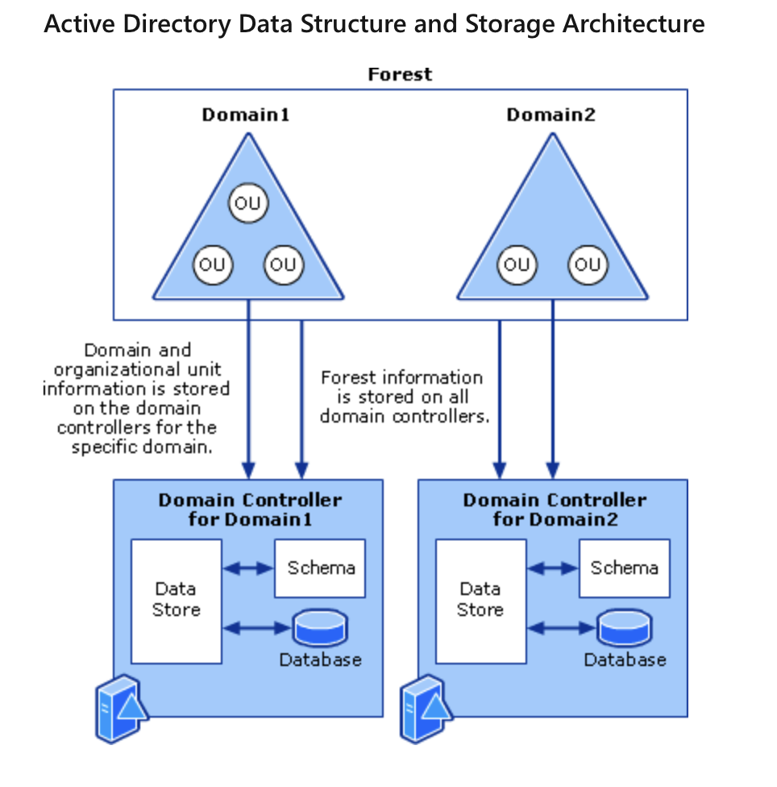

# Trust

Trust is entity or say relationship between two domains and allows the domains which provides access of domain resources. *You might ask what kind of resources?* Baiscally it could be any resources. There are different kind of domain, as listed below:

1. **One-way Trust** 
  - The trust that is only uni-directional, meaning on domain can use resroucess but another domain can't do that same.
  - If there are two domain, then one domain can have trust for the another, but another domain will have any trust for that domain.
2. **Two-way Trust** 
  - The access is allows from both the side and there is access from both the side for other sides
3. **Consecutive Trust**
  - If there is transitive trust between two domain, meaning if there is trust between two domain and one of the domain has trust of third domain, then there is trust within the three.

SO all these features are available in **AD**, which you don't need to create, they already exists. Now we know about parent and child domain from [day 2](cosa-docs/windows/day2/day2.md) and therefore, we'll create a **forest** using these child and parent domains.

In the below example, if **sunbeam.lab** trust **cdac.lab** has an child domain, say **Acts.cdac.lab** which we eventually can assume, that there will be trust between all these, so automatically there will be trust between them, **transitive trust**.

- **`dsc.msc`** 
  - This is another shortcut that can be used in order to create the **Active Directory Domain Services**. Thus, these are users created in the directory.

- **Setup time** and **creating domains**
  - Make sure that you've configured the time
  - Then you need to give the client the same domain as that of your, if not, the user won't be able to communicate.
  - Therefore, Active Directory is very important and main advantages of using **AD**.
  - This set up involves the configuration of users on various machines and therefore, you can use **logon**.
  - You can also give **time restriction** in order to assign the users their respective logins and domains.
  - *So how do you plan?* Thre will be security challenges as there would be requirement.

- **Account Expiration**
  - The account will be expired on time, when the contract with the user is finished. It is because you might not remember what requirement and what number of users might come across. 
  - You are also expected to give the restrictions to the users.

# Steps to Create ADC

- Go to manage 

# Adding Tree domains and Child domain 

- There can be multiple forest multiple domain and thus multiple **environment** domains.
- Remember while accessing the user from another domain, login is only possible if there is trust within the domains and also while accessing the database, you need to tell it which domain it belongs to.
- Use *domain/user* to login.

- You first need to check for the DNS server within the forest. If they can't ping each other that means DNS is not properly configured.

# Logical Modal of AD

Refer to [Active Directory](../concepts/active-directory.md) if you need to learn more about its logical existence. Though the modal stands on Forest, Domain, and Organisational Units. Forest consists of domains, that divides the forest in smaller section, such that there is high availability among the resources within the forest. Then, further domains contain Organisational units that makes it easy to handle the user data and accounts, setting group policies and control over the organisation.

# How does DNS works within a Forest

We know DNS was created to translate and provide IP addresses used on the *Internet*. There are two components connected with this DNS system:

1. **Root Servers**
  - Root Servers are made of fixed IPs that stores the collection of **top-level** IPs, such as **.com**, **.edu**, **.org**, and **.in**. 
  - All these Servers are maintained by the Internet Authority and these collection is called **TLD servers**.

2. **TLD Server**
  - These TLD servers makes all the updates whenever a new domain is added on the internet and all the TLDs are connected to internet as well as your ISPs too are connected to the these **root servers**.

DNS uses port 53, using **TCP** and **UDP** simultaneously. THis is important as if you need to check on the open ports, if you see the port 53 open, meaning DNS is running otherwise not. *Now how these technology work?*. Thus there are two things that can be considered:

1. Forward Lookup
  - Client gives names to DNS server and DS server returns IP for the name. 
  - It is called **name-to-IP** mapping

2. Reverse Lookup
  - Client gives IP to DNS server and DNS servr returns name for the IP. 
  - It is called **IP-to-name** mapping.

Forward and Reverse Lookups is how we get out DNS server created and therefore, now you need to create the record of IP addresses.

1. **Type A** records
  - These records maps **name** to IP addresses
  - **AAAA-host-IPv6** reocrd

2. **Type PTR** record
  - This is called Pointer record that maps **Pointer** to **name**.

3. **Type CNAME** record
  - This is called **Conanical Name**
  - THis is alias record, creates duplicate name of same IP address.

4. **Type MX** record
  - It identidies the email server fo the domain.
  - This is the record that takes care of the emails of the users which identifies the user records
  - Because the user might don't know what email of the company is so they can't send email to the company.

5. **Type SRV (Serivce Locator Record)** record
  - Identifies the server IP address and port number where a specifiv service is running.
  - SRV runs services from **AD DS**, which are **LDAP** using port *389* and **Kerberose**, using port *88*.

Remember that you don't need to create multiple MX type record for every **tree** in the **forest**, and therefore you don't need to 

#### `nslookup` *name*

The name of the domain can be looked through the following command on windows and look for the ip address of any webiste. You can simple write the name fo the domain, and nslookup will give you the IP addres of the domain, but you reverse lookup is not possible as the ris no **reverse lookup zone** established on your system.

#### `ipconfig /displaydns`

It shows the DNS cache stored for all the DNS lookups and is used in Windows System. This helps in speeding up the resolution process of the DNS resolver.

