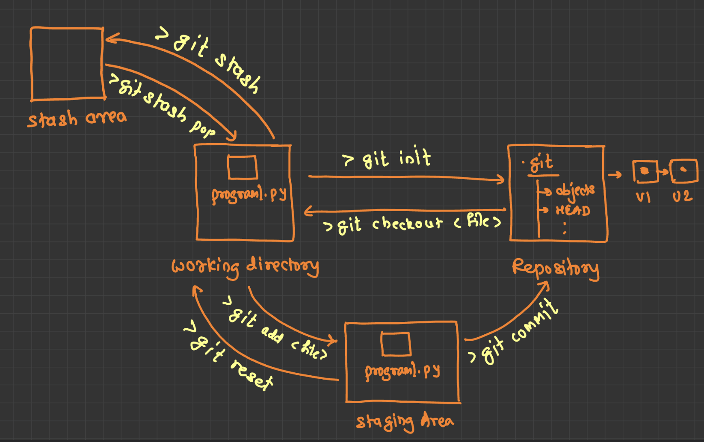

# What is DevOPS?

One field is on tht involves developer team, another is operations team (Adminitrators, Resource Providers).

# SDLC (Software Engineering)

- **Planning** - It is the requirement gathering and resource gathering phase.

- **Defining** - This is the phase where we go into more depths and we define what kind of requirements that we are using. This is called SRS (Software Requirement Specifccations), developers start looking into it and starts developing and testers start testing using it.

- **Designing** - This is where the solutions will be designed with the right approach, it is the job of the software architect, who will design the whole solution. Depending the SRS, the designing is choosen, such as UX/UI, database structure to be used, the arcchitecture to be used (for example, monolithic, microservice, peer-to-peer, client-server).

- **Building** - This is where developers and development of the project comes in, different frameworks, technologies are used.

- **Testing** - All the requirements are to be tested and the testers make sure that application is tested properly.
  - Types 
    - Mannual Testing
    - Automated Testing
  - Methods
    - Black Box - In this, testers don't have access to source code
    - White Box - There is access to source code, and testers check the internal structure of the sourcfe code.
    - Grey Box - This is where there is some restricted access to the source code. 
  - Level
    - Functional Testing, it is tested to test all the functionality
    - Non-functional Testing

- **Deployment** - Operation people comes in and makes the application available for the rest of the world. 

# Dev Team

The developers major responsibility is to develope a application mentioaned in SRS, adding a new feature, but not only this, dev will be packaging the application. *What does it means*, it is packaging the application, suppose thane andorid application, such as **.apk**, all the packages involved in the developent of the application during the building the application. 

Development, once done, testers throughly tests the application using the SRS. 

# Operation Team

Making all the necessay resources available, you need to make that resource application configured in the right way such that network resource avaialable. It could be **network**, **hardware**, and **machine**. As an adminitrator, all the **Environement** should be configured for the development of the resources.

lets talk about kind of environments.

- **Dev Environment** - This is where the developers will have access to the backend, frontend, and database. 

- **Staging Environment** - This involves the server

- **Pre-Production Environment** - 

After setting up multiple enviornment, there is monitoring the environment, so there are different tools to monitor the environment.

# Agile Development

In order to tackle the problems that are faced during the management of the Infrastructure, we split the whole modal into smaller parts and then it is dealt individually called **Stories**.

Agile Development uses the **Sprint**, we create multiple different sprints, that have defiend time-period, that defines what stories are to be taken care when for a particula sprint. It has the collection of selected stories that will defined within a single Sprint.

Then there is **Sprint Planning Meeting**, that involves the planning meetings on a sprint that is going on, where every discuss what kind of tasks needs to be done with the sprints, basically everyone plans the what stories are to be involved while defining a particular sprint.

There will be Sprint Backlogs that will have all the records of number of sprints that needs to be finished with each sprint. 

* Scrun master 
* Product owner - 
* Dev team -  involves the developers, 

# Problems Faced


# Frameworks 

The **SCM** tools such as **git** that we use is used in the industry everyday.

- There is mult

# What is DevOPs?

It involves both the team **developer** team and **operation** team, this promotes the CI/CD pipeline that takes care of the collaboratin between the two team, such that there is contineous flow of automation and repeatable services.

# Plan

You are going to create multiple stories, plan for the their time period, there are simple and generica tools, such as the follwoing:

- **Text Editor**
- **Google Sheet**
- **Excel Sheet**

Then there is several Cloud Tools.

- **OneDrive**
- **Google Drive**

Then there are Developers tools.

- **Jira**, one of the best tools available, where you can add developers and assign tasks, atlasisan 
- **OrangeServer**
- **Trello**

# Code

This the where actual development will start, so there are multiple tools involved here. There are many languages that you can start with.

- **Language**
  - C, CPP, JAVA, Swift, JavaScript
- **IDEs**
  - PyCharm
  - VS
  - WebStroam
  - Android Studio
  - XCode
- **Editor**
  - Notepad
  - Atom
  - VS Code
  - Sublime
- **SCM** tools
  - git
  - SVN
- **Package Management Tools**
  - npm
  - chocolate
  - pip

# Build

It is called the building process where you required to install the application pacakges, for example, in windows we are using the **.exe/.msi**, for ipad and iphone there is **.ipa** and then there is building tools, such as ant, maven, gradle.

# Test

This is where you should be executing the automated tests, ther are multiple levels of testing. Under Functional testing we can see, **unit testing**, **NUnit** testing, for **Java**, there is **Junit**.

Then there is Integration Testing, where there is Jasmin, for JavaScript. 

Then there is UI testing, there is Selenium that is for testing purpose. 

Then in case of **Non-Functional**, there is **Load Runner**, **Jmeter**, 

# Release

This helps in over all sequence of multiple stages where you implemetn the CI/CD pipeline. It is where you finally deal with stages, such as scm, build, testing, env, deployment.

# Deploy

Manage and maintain the deployment, there are differne deployment strategies.

- traditional deployment - Using physical machine
- Virtualised deployment - VMware, Virtual Box etc.
- Containerized deployment which required Docker, Podman, **container orchestration (Docker Swarm, Kubernetes)**.

# Operate

- Environment Createion tools - Vagrant, terraform, Cloud Formation from AWS.
- Environment Configi tools - Puppet, 

# Monitor

Tools that we use are as follows, Nagios, DataDogs, Splunk. Then for debugging the application, to liberate, there is **New Relics**.


# Version Control System

You're likely referring to three categories of Version Control Systems (VCS), although the acronym "SVM" isn't commonly used in this context. The three main types are:

1. **Local Version Control Systems (LVCS):**

   * **Logic:**  The simplest form.  Files are copied into a new directory (often timestamped) for each version.  This is entirely local and offers minimal features.
   * **Example:**  RCS (Revision Control System) is a classic example.
   * **Limitations:**  No collaboration features, difficult to manage for larger projects, prone to human error (e.g., forgetting to copy or using the wrong directory).

2. **Centralized Version Control Systems (CVCS) (e.g., SVN, CVS, Perforce):**

   * **Logic:**  A central server holds the repository. Developers check out files, make changes, and commit them back to the central server.
   * **Advantages:**  Better than LVCS for collaboration, provides a single source of truth, access control is easier to manage.
   * **Limitations:**  Single point of failure (if the server goes down, no one can work), branching and merging can be complex and less efficient than with DVCS, requires constant connection to the server.

3. **Distributed Version Control Systems (DVCS) (e.g., Git, Mercurial, Bazaar):**

   * **Logic:**  Every developer has a full clone of the repository.  They can work independently, commit locally, and then push/pull changes to other repositories (including a central server if desired). Unlike CVCSs (Centralised Version COntrol System), it is not like where you can't make a clone of the repository and scale the overall repository, becauese it uses **http**.
   * **Advantages:**  Robust branching and merging, works offline, no single point of failure, faster operations (most actions are local), better collaboration features.
   * **Limitations:**  Larger initial clone size (since the entire history is downloaded), can be more complex to learn initially, requires more storage space on developer machines.


**Key Differences Summarized:**

| Feature        | LVCS          | CVCS            | DVCS              |
|----------------|---------------|-----------------|-------------------|
| Repository     | Local         | Central Server  | Every Developer   |
| Collaboration  | Limited       | Basic           | Advanced         |
| Offline Work   | Yes           | No              | Yes              |
| Branching/Merging | Difficult     | Complex         | Efficient         |
| Single Point of Failure | No           | Yes             | No              |
| Scalability   | Poor          | Moderate         | Excellent         |


**Example Scenario:**

Imagine a team working on a website.

* **LVCS:** Each developer would have their own set of folders with different versions of the website files. Sharing changes would involve manually copying files, which is error-prone and inefficient.

* **CVCS:** The website files would be stored on a central server. Developers would check out files, make changes, and commit them back to the server.  If the server is unavailable, they can't work.

* **DVCS:** Each developer would have a complete copy of the website's repository on their machine.  They can work offline, create branches for new features, and merge changes easily. They would typically synchronize their changes with a central server for collaboration, but the server isn't essential for day-to-day work.

DVCSs, especially Git, have become the dominant type of VCS due to their flexibility, power, and ability to support modern development workflows.

# Basic Workflow

The diagram shows the flow of changes from your working directory, through the staging area, into the repository, and how the stash can be used to temporarily store uncommitted changes.



1. **Working Directory:** This is where you make changes to your files.  The example shows a file named `program.py`.

<br>

2. **Staging Area (Index):**  Before committing changes, you add them to the staging area. This lets you select which changes you want to include in the next commit.  `git add <file>` moves files from the working directory to the staging area.  `git reset` removes files from the staging area.

<br>

3. **Repository (.git directory):**  This is the Git database storing your project's history.  It contains all commits, branches, and other Git data.  `git init` initializes a new Git repository in your project directory.

<br>

4. **`git commit`:** This command takes the changes from the staging area and creates a new commit in the repository.  Each commit is a snapshot of your project at a specific point in time.  v1 and v2 likely represent different commit versions.

<br>

5. **`git checkout <file>`:** This command retrieves a specific file from the repository and places it in your working directory.  It's often used to revert changes or retrieve older versions of a file.

<br>

6. **Stash Area:** This is a temporary storage area.  `git stash` takes your uncommitted changes from the working directory and the staging area and saves them to the stash. This clears your working directory and staging area.  `git stash pop` retrieves the most recently stashed changes and applies them back to your working directory.  This is useful when you need to switch branches quickly without committing your current work.

<br>

```
Working Directory  -->  Staging Area  -->  Local Repository  -->  Remote Repository
     ^                                       |
     |                                       |
     (git checkout)                          (git push/pull)
     |                                       |
     (git add)                              (git fetch)
```

# `git init`

With the help of this command, a .git subdirectory is created, which includes the metadata, like subdirectories for objects and template files, needed for generating a new Git repository.


# `git config`

* **Local (repository-specific):**  This is the most specific level. These settings only apply to the current Git repository.  The configuration file is stored within the repository itself (in the `.git/config` file). By default, if you don't specify a level, `git config` writes to the local level.

* **Global (user-specific):** This level applies to all repositories owned by the current user on the system. The configuration file is typically located in your home directory (e.g., `~/.gitconfig` or `~/.config/git/config`).  This is where you'd typically set your global username and email.

* **System (system-wide):** This is the broadest level.  These settings apply to all users and all repositories on the entire operating system. The location of the system-level configuration file varies depending on the operating system, but it's usually somewhere in the system's root path (e.g., `/etc/gitconfig` on Linux/macOS). This level is usually managed by system administrators.

# Basic Workflow

**Creating a Repository:**

Start by creating a new directory for your project (`mkdir /tmp/myproject`).  Initialize a Git repository within that directory using `git init`. This creates a hidden `.git` subdirectory, which stores all the metadata and version control information for your project.

**Checking the Repository Status:**

Use `git status` to see the current state of your repository. It shows which files have been modified, added, or are untracked.  For a more concise view, use `git status -s`, which uses a two-character code to indicate the status of files relative to the staging area and the working directory.

**Committing Changes:**

After making changes to your files, use `git add <file>` to stage the changes you want to include in the next commit.  `git commit -m "<message>"` saves a snapshot of your staged changes to the repository, along with a descriptive message.

**Viewing Commit History:**

`git log` displays the commit history of your repository, showing each commit's author, timestamp, and message.

**Comparing Changes:**

`git diff` shows the differences between your working directory and the last committed version.

**Reverting Changes:**

`git checkout <file>` replaces the working directory version of a file with the last committed version from the repository.

**Resetting Changes:**

`git reset` moves staged changes back to the working directory (soft reset). `git reset --hard` discards all changes in both the staging area and the working directory, reverting to the last committed version (use with caution!).

**Stashing Changes:**

`git stash` temporarily saves your uncommitted changes to a separate stash area, clearing your working directory and staging area.  `git stash list` shows all stashed changes. `git stash pop` retrieves the most recently stashed changes and applies them back to your working directory.  This is useful for switching branches without committing incomplete work.
