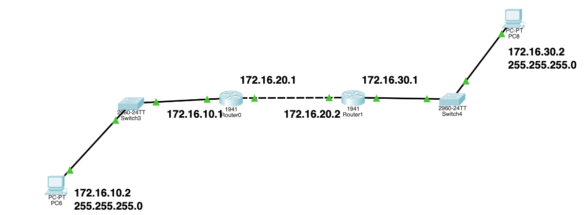
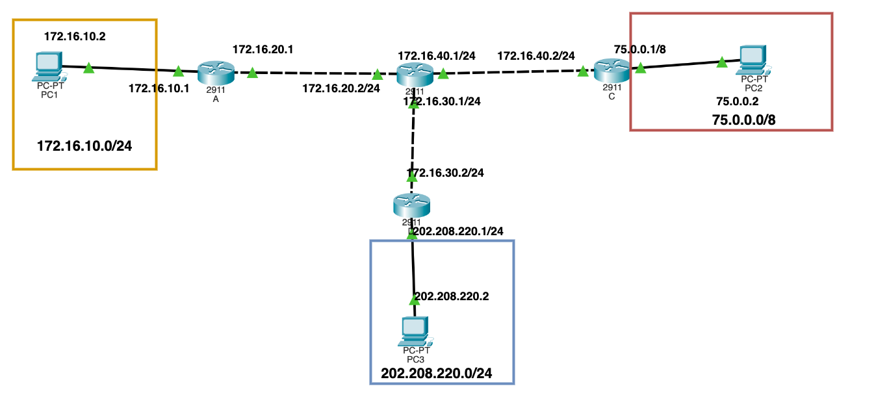

## Configure Static Routes
Consider the below given network digram:
 

- **Configure Hostname and Passwords**
- **Configure Interface**
- **Configure Static Routes**

After configuring the static routes, use the following `show` commands:

- show version
- show session
- show user
- show cdp neighbour
- show cdp neighbour detail
  - no cdp enable
  - cdp enable
- show interface 
- show interface br
- show ip route

Perform the same set of commands on the below given network diagram:
 

