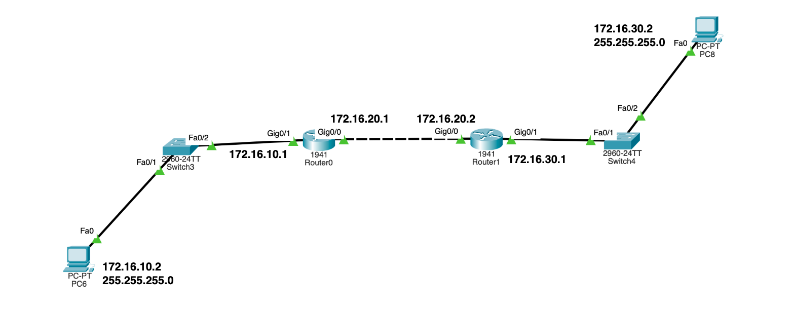
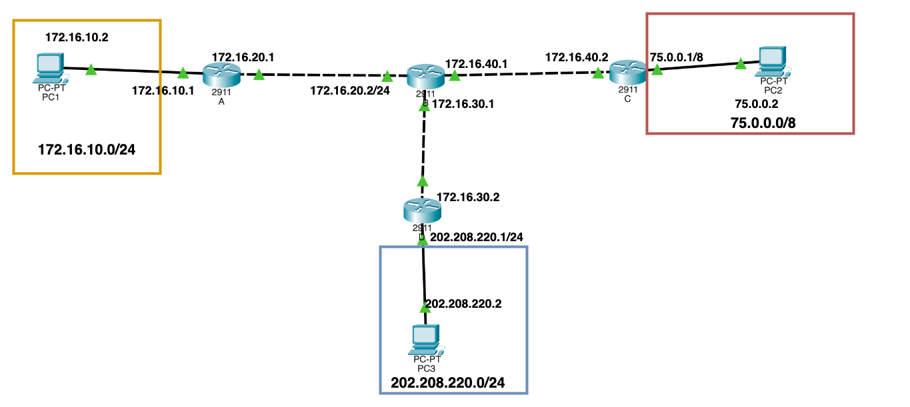

# Configure Static Routes

Consider the below given network digram in *Network 1*, *Network 2*, and *Network 3*, and perform the following configurations on these networks:
- **Configure Hostname and Passwords**
- **Configure Interface**
- **Configure Static Routes**

After configuring the static routes, use the following `show` commands:

- show version
- show session
- show user
- show cdp neighbour
- show cdp neighbour detail
  - no cdp enable
  - cdp enable
- show interface 
- show interface br
- show ip route

 

### Network 1

- First open the host machines and configure the IP addresses of the following Machines, as given in the diagram.
- Second, you need to configure the routers based on the network and subnetworks assigned to routers. 
**Detailed Steps**

|    |Commands       | Purpose       |
|----|---------------|---------------|
|Step 1| `enable` and then get into the global configuration mode using `configure terminal`| Enter into Global Configuration Mode|
|Step 2| Use `line console 0` and set password `password` *password*| Setting password verification at the console session|
|Step 3| Use `login` and `exit`| Enabling password verification at the console session|
|Step 4| Now use `line vty 0 4` and `password` *password* | Configuring **vty** line verification password |
|Step 5| Now `login` and `exit`| Enabling the verification at the telnet session|

- Now the **line** configurations are done, so we need to configure the routers password verification
 

|    |Commands       | Purpose       |
|----|---------------|---------------|
|Step 1| `configure terminal`| Enter Global configuration mode|
|Step 2| `hostname` *host-name* and `enable secret` *cisco*| Specifying the encrypted password to prevent un-authorized access to the router|

 

- After creating the **hostname** and **encryption**, you need to start configuring the routers **IP address**
- Go to **Router0** and as specified in the network diagram configure the **IP address** on both interfaces
  - Go to `conf t`, then `int g0/0` and configure IP using `ip address 172.16.10.1 255.255.255.0`, and don't forget to `no shutdown` as if didn't, your interface won't show **up**.
  - Now configure `int g0/1` and configure `ip address 172.16.20.1 255.255.255.0` and `no shut`
- Now go to **Router1** and configure on both the interfaces
  - **First** you need to configure the **line** and **password** done above and then you can go ahead with the IP Configuraions.
  - Enter `int g0/0` and `ip address 172.16.20.2 255.255.255.0` and `no shut`
  - Then enter `int g0/1` and `ip address 172.16.30.1 255.255.255.0` and `no shut`

**Performing the Static route configuration** 

Now that we've configured IP addresses, we can go ahead and configure the **static Routes** for the routers.

- Simple we need to tell **Router0** (in the diagram) that if the packet wants to go to **`172.16.30.1`** ,i.e., in subnet `172.16.30.0/24`, it need to hop it to **Router1**, i.e., **`172.16.20.2`** and similarly we could tell the same to **Router1**, that if packets needs to `172.16.10.0/24` the next hop is **`172.16.20.1`**
- **Router0** static route - `ip route 172.16.30.0 255.255.255.0 172.16.20.2` 
- **Router1** static route - `ip route 172.16.10.0 255.255.255.0 172.16.20.1` 

### Network 2

 

Remember that in this Network diagram, one router takes **three interfaces** so you need to take the **2911** router.

The above network digram goes the same way, though all the configurations are standard as they need basic configuration of the *hostname*, *passwords*, and *ip addresses*. So we'll directly go ahead with the **Static Route Configuration**

**Performing the Static route configuration** 

- Router **A** - `ip route 202.208.220.0 255.255.255.0 172.16.20.2`, `ip route 75.0.0.0 255.0.0.0 172.16.20.2`
- Router **B** - `ip route 202.208.220.0 255.255.255.0 172.16.30.2`, `ip route 75.0.0.0 255.0.0.0 172.16.40.2`, `ip route 172.16.10.0 255.255.255.0 172.16.20.1`
- Router **C** - `ip route 202.208.220.0 255.255.255.0 172.16.40.1`, `ip route 172.16.10.0 255.255.255.0 172.16.40.1`
- Router **D** - `ip route 172.16.10.0 255.255.255.0 172.16.30.1`, `ip route 75.0.0.0 255.0.0.0 172.16.30.1`
  - The below method is called `Default Route` which is not recommended as you'll see in the next network which requires only static routes to be configured
  - `ip route 0.0.0.0 0.0.0.0 172.16.30.1`

### Network 3

Configure the Network such that **PC0** cannot communicate with **PC3** and **PC4**, else everyone can communicate with each other. This example 

Lets start by configuring the routers:

- **Router0** - `ip route 172.16.30.0 255.255.255.0 172.16.20.2`, `ip route 192.168.100.0 255.255.255.0 172.16.20.2`, `ip route 172.16.50.0 255.255.255.0 172.16.20.2`
  - Though the traffic, or say packet of **PC1**, would be able to reach till **Router2** connected to **PC3** and **PC4**, it won't be able to come back to **PC1**.

- **Router1** - `ip route 192.168.100.0 255.255.255.0 172.16.40.2`, `ip route 172.16.50.0 255.255.255.0 172.16.40.2`, `ip route 172.16.30.0 255.255.255.0 172.16.40.1`, `ip route 172.16.10.0 255.255.255.0 172.16.20.1` (Because we want the PC2 (in the diagram) should be able to communicate with the PC0), as PC3 and PC4 aren't allowed to make a communication.
  - This is where we are telling router to be able to communicate with `172.16.10.1`, because if the packet wants to go to PC0, as at Router1 it still won't know where to send the packet, so it will leave.
  - This is where you can witness the **Two-way communication** paradigm.

- **Router2** - `ip route 192.168.10.0 255.255.255.0 172.16.40.1`, `ip route 172.16.30.0 255.255.255.0 172.16.40.1`

If you don't mention the packet with **destination** address `172.16.10.1`, it will be eventually getting dropped by routers and the static path to the network is not mentioned at all. So this is where we are preventing a **Two-way communication**. 

