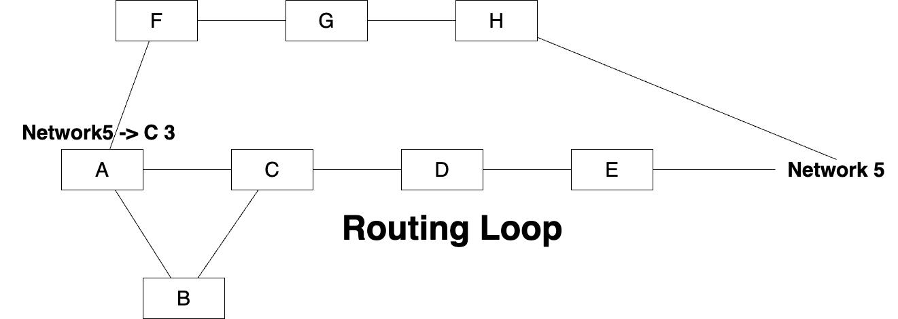

# Distance-vector Routing Protocol

Refer to [day 6](../day5/day5.md#cisco-commands) to learn more about

### Administrative Distance

Refer to [Day 6](../day6/day6.md) where we discussed the Routing on routers, we were providing interface IP address, that is called **Directly connected routes**. These routes we configure directly and we are able to create a static route. Remember that when we are dealing with **Multi-access** network, so it is standard practise to configure the **next hop** address only.  

*what is AD (Administrative Distance)?* It is the distance that tells router is the main route is **down**, then the route with the **AD** will be considered. 

- Configure the route with administrative distance using `ip route` *destination-address* *subnet-mask* *next-hop* ***amininstrative-distance***
- Use `ip route` *destination-address* *subnet-mask* *next-hop* ***amininstrative-distance*** *permanent* in case when the new address will be discoverd as the rpevious one will be viped out so you owuld need to configure the provous address again, so you need to confgure it again.

In the above case you need to configure about 6 routes in order to assign the alternate routes, so in that case it is very difficult to scenario. 

### Dynamic Routing Protocol - RIP (Routing Information Protocol)

**RIP** is a distance-vector protocol that broadcasts **rip** packets to the next routers connected, as it is only send to the routers it is not understandable to the hosts connected. So there is information passed over the interface and through packet (RIP) the source IP of the router interfae is passed as it is accepted to the router on other side, and the entry on the router is made in the other router.

**Router B** will also share the same packet as the **destination** would be 255.255.255.255 and the soruce IP of the router, as if any router is connected say ther is an alternate path on the router, the new entry from the **Router C** will be created. 
<br>


Basically if the routers connected shares their **routing table** with each other, such that without writing the static routes, you can create **R** entries on the routing table.

The RIP when configured is shown with the **R** as the new entry.

- Use `router rip` to start the rip an

```
Router(config)#router rip
Router(config-router)#
```

- Use `network` *classful value*, meaing you need to specify the classful value that specifies the network of the outer is connected directly to.
- In case there are two networks, say `172.16.10.1` and `172.16.20.2` and then you also have `202.208.220.1`, then your network command will we:
```
A(config-router)#network 172.16.0.0
A(config-router)#network 202.208.220.0
```
- But remember that **classful value** is given on the **directly connected** networks only. In case of the **Router B**, there will be only one.
```
B(config-router)#network 172.16.0.0
```

*What is Hop count?* **Hop** is the number of router between soruce and destination, meaning how many routers the packet has to pass in order to reach the destination. **See the diagram** as you can see how many hops the router has to take in order to reach the destination.

When your routers will be connected through **RIP**, you'll see the following route after `sh ip route`:

```
R       172.16.10.0/24 [120/1] via 172.16.20.1, 00:00:22, GigabitEthernet0/0
```

The **[120/1]**, where **120** is the **Administrative Distance** and **1** is your **Hop Count**.

**Consider the below  scenario**, where we've a network that has the two networks conneccted and we'll try building the routing table using the **RIP**, thus you can say that the route get transferred through **RIP Packets**.


#### Equal Cost Load Balancing 

- If rip founds out that there are more than two paths with the same hop count, then **RIP** works with **Equal Cost Load Balancing**
- This means that **rip** will balance the traffic between those two paths and distribute equally on those paths
- **RIP** could balance the load upto **4 Paths** which is by default and **maximum upto 6 Paths**

#### Pin Hole Cogestion 

- The only **drawback** of the RIP is that many times there are few network topologies where huge amount of traffic occurs inspite of the alternate path present, this is called **Pin Hole Cogestion**. 

#### Subnet Mask Issue

- Another drawback is that the network **subnet mask** is assumed to be classful, meaning it only recognises the network based on the classful addressing of the IP address, if there are hosts with different subnet mask but router will not recognise the subnet mask as `/23` or `/29`, it will only check the class of IP address and assume the subnet-mask of that class.

#### FLSM (Fixed Lenght Subnet Mask)

- Therefore, you need to use **FLSM (Fixed lenght subnet mask)**, as *rip does not consider CIDR subnet mask*, as the administrator might be needing to configure all the networks in the subnet, say `/24`, `/16`.

#### Passive-interface command

- **Giving passive interface**, basically it won't send any RIP updates to the specified interface, on that interface, but remember that **Giving passive-interface is not equal to not giving the network command**, meaning this doesn't mean that it can't recieve the updates. 


- In the network diagram the updates are recieved from the **Router1** but **Router1** can't know any network connected to the **Router0**

- Remember when using `passive-interface g0/1` would only think that there is no routers on that interface, so there is no need to give the **rip packets** on that interface, but you need to specify the `network` *subnet* in order to make that network reacheable.


| RIP      |    RIP v.2  |
|----------|-------------|
|RIP needs the FLSM ot work with| RIP v.2 can work with VLSM|
|It doesn't send S.M information| RIP v.2 sends the S.M. messages|
|Classful -> 255.255.255.255| RIP v.2 sends a multicast add -> 224.0.0.9|
|It can't have authentication| It can have authentication|

- To implement the RIP verison 2, just execute the command `version 2` in `(Router-config)`, but remember that if we are working with version 2 and another router is working with version 1, then our router will also work as **version 1**.


***What is routing loop?*** Routing loop is when there a network down and the status of the network is not accurately updated due to the delay. If you consider the diagram of the network below:


As the **network 5**, when starting from **ROuter A** is reachable **via** **Router B** and also through **Router C**. If due to any delay the network 5 unreachability is not achieved, then there would be unnecessary updates to the **Router C** that **network 5** is reacheacble and hence there would be looping **RIP** packets in all the network. 

#### Hop Count Limit

Though this kind of problem only aries in the **Redundant networks** only, thus, this makes things complicated. The remedy was to use **TTL**, as the value of TTL gets updated the bit is done **15** hops in between. 

#### Split Horizon

If Router A learned about **Network 5** from Router C, it'll (Router A) not advertise back about the network 5 back to the Router C, as it learned it through Router C. SO Routers don't advertise info on the same network which they learn back to Routers. This prevents the **Routing loop**.




#### Hold-on Timer

The memory is updated with the updates recieving on the interface about the **Network 5**, as it would recieve no updates regarding the network 5 and routers would be listening to the network and will update the memory, it flushes the entry of the network 5 after the contineuous inspection of **180 sec**, then once the router find the topology, the updates are forward instantly and the entry is made, meaning a new entry is made.

#### Trigger Update

Trigger updates are the updates made instantly when the network topology undergo any changes, thus this makes the updates in the network topology,

#### Dont Listen until Hold-on Timer

ANother solution if there will be no action taken on that down network.

#### Route Poisoning 

If the network is not available that means the network will be available at **16 hops**, meaning, if there is no netwowk available the router will send the reply that network is available after 16 hops, instead of telling that the network is **down**. This is called **Poison Reverse**.


|       |RIP Timer  |
|-------|-----------|
|Update| 30sec|
|Hold-on/Invalid| 180sec|
|Flush| 240sec|

In the case of unreachability to network 5, there is possible that either the neighbour is down or the netowrk is unreachable. 

lets consider the below example where we've already configured:
- router **A** with `passive-interface s0` and `ip route 172.16.0.0 255.255.0.0 172.16.20.2`, meaning route to `172.16.0.0 via 172.16.20.2`.
- router **B** with `passive-interface s2` and `ip route 0.0.0.0 0.0.0.0 172.16.40.2` and 
- router **C** with `passive-interface s0`

Now you need to tell what behaviour the router **A**, **B**, and **C** would have.


Remember one of the `passive-interface` *interface* behaviour where if there is going to be no **rip** packets on one interface that doesn't mean that **router B** won't be able to recieve from **Router A**.

