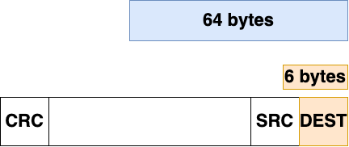
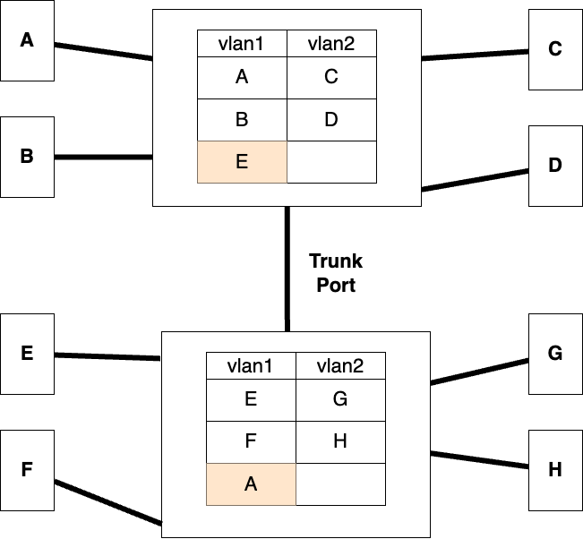

### Configuration of the EIGRP

COnfigure the RIGRP routing using `router eigrp` *process-id* and then `network` *sub-network*. It is also called **Hybrid Routing Protocol**


**One** feature is called **Auto Summarization**. It basically automatically tell the higher network that there is another network connnected to ther interface, think of it two autonomous system and if both of them will be sending the same subnet, meaning from one side there will be 172.16.X.0 and from another side too, there will be 172.16.X.0, that is called **Discontingeous Subnets**, meaning message will be override with one another. And Cisco then enabled an command with `no auto-summary` to remove the auto-summary.

**Another** feature is **Bandwidth Management** by default the 50% of the bandwidth will be utilized by itself. The bandwidth captured by the **EIGRP** can be controlled, even you can change it to 1% accordingly. Such that in that case any other important info could be send via the link, but remember that through this there are **delays**.

The algorithm used by EIGRP is **DUAL Defussing Update Algorithm**. It is Cisco Property, owned by Cisco, though EIGRP is Public.

Similar to the OSPF, the same commands are in **EIGRP**, such that there is no link-state in EIGRP, there is **Topology**.
```
show ip eigrp topology
sh ip eigrp neighbour
sh ip route
```

# Switching 

There are certain ways in how Switching takes place:

- (1518 bytes), which stores and forward the frames
- (6 bytes) cut through
- (64 bytes) Modified cut-through

**Store and forwad** can get delayed as there will be some dealy, byt in the secod mechanism, the 6 bytes are only going to send the first 6 bytes and till the time decision is made, the frame is already on it way to be send.

**Modified cut-through** is where there are inspection on the first 64 bytes, first 64 will decide if these frames are okoay, then the forwarding decision is implemented, ultimately it won't be fast as **cut-through**, but not that slow as that of the store & forward.



About **latency**, it depends solely on the **frame-size**, larger the frame, larger will be the latency. Threfore in the Modified cut-through latency is **very low** because there won't much to **read**, as in case of the regular frame, the switch will be reading the while froma eof 1518 or any less, near the same size, still it will be lots of data of read for switch while in contrast to that of the Modified cut-through, there will be a **fixed** amount of delay. 

In switches if there is **Unknown** MAC address, it is going to flood it out of all the interface, it is only te learned MAC address that will be send out of the specified interface. The frame that is the Broadcast, that frame will be obviously send out through all the interface.

### Spanning Tree Protocol

In the switches when there are broadcast storm, Spanning tree protocol can be used in order to do what we'd do manually.

Every switch has a MAC address that manages itself through it, and every switch priority is set through the **lowest Switch ID**. Then there are **BPDU** messages, that contains the Switch ID and other information and these messages are sent by every other switch to other switch in the network. Once there is table established that who is the lowest, then only the one with the Lowest SWitch ID will be sending the BPDU messages. These **BPDU** messages are send every 2 sec. 

The lowest switch ID assigns itself the **Root Switch**, and hence every switch is able to idetify that there is only on root in the whole network. This allows the other switches in the network to be able to generate the **Desginated port**, which will not recieve the messages from the **root** port, meaning there is a **root port from which other switches are able to recieve the message.

Now there is an election to decide who is going to be the **telender switch**, the one that will close one of the interface to recieve the frames. If there are more than one switch with the same STP cost, then there is going to be another criteria, it will follow the lowest Port ID.

There can be a tie for a non-designated port, if there are more than one non-designated. 

After you connect the hosts from a switch, there are four stages for the Switches, as it takes 50 seconds to come online:

- **Blocking** - First it blocks the network
- **Listening**
- **learning**
- **Forwarding**


*let's talk about switches.* we can't assign a switch interface with an IP address, so we nned to telnet, therefore we need to use **VLAN**, meaning we assign IP address on that switch interface. Thus you can configure a IP, Defaulr gateway, and Subnet mask. In order to enable the default gateway you need to get out to the vlan and then `ip default-gateway` *ip-address* *subnet-mask*.

```
Switch(config)#int vlan1
Switch(config-if)#no shut

Switch(config-if)#
%LINK-5-CHANGED: Interface Vlan1, changed state to up

Switch(config-if)#ip add 172.16.10.100 255.255.255.0
Switch(config-if)#exit
Switch(config)#
Switch(config)#ip default-gateway 172.16.10.1
```

You can configure the port address to the system using `switchport port-security` *mac-address* `stick`, here sticky means that you are restricting the *mac-address* to the specific port only. Another is `switchport port-security violation shutdown` to tell the switch what to do if the port-ecurity is violated.

You can also perform **port-security** for all the ports in a **range**, where you can configure the range of ports simultaneously.

```
Switch(config-if)#int range f0/1-10
Switch(config-if-range)#switchport port-security mac-address sticky
Switch(config-if-range)#switchport port-security violation shutdown
```

### VLANs

VLANs only creating a seperate swithes within the switch logically, mening all the broadcasts within one VLAN will be only part of one switch within the vlan only, meaning all the broadcast will be send within the vlan only. **VLAN** also ensures the ecurity of the domains as it seperates the network within a single switch.

***How do you create a vlan?*** Create the vlan using `vlan` *number*, then give name using `name` *name*.

```
**Creating Sales Dep**
Switch(config)#vlan 2
Switch(config-vlan)#name sales
Switch(config-vlan)#exit

**Creating Purchase Dep**
Switch(config)#vlan 3
Switch(config-vlan)#name purchase
Switch(config-vlan)#exit
```

***How do you add port to vlan?*** You can add a port to vlan by getting into the interface and assign them a vlan created. Use `switchport access vlan` *vlan-number*. You can also use **range** in order to assign the interfaces to the specific vlan.  

```
Switch(config)#int range f0/2-5
Switch(config-if-range)#switchport access vlan 3
Switch(config-if-range)#
%LINEPROTO-5-UPDOWN: Line protocol on Interface Vlan1, changed state to down

Switch(config-if-range)#
Switch(config-if-range)#
```

Remember that **VLAN 1** is called *Mother, Parent, Management, and Untagged* vlan. 


In the organisation there are going to be multiple switches that will be used, the network diagram can be seen as below:


<br>

- For SW2, machine E and F MAC address will be learned on respective vlan. 
- A will send ARP messages will be send with the **Src** of the sender and **Dest** of the broadcast address, and body will have the message to find the E
- In order to communicate there should be **trunk port** configured on both the interface that are communicating over the vlan, but on different switch.

The configuration can be done as below:

```
SW1(config)# int f0/1
SW1(config-if)# switchport mode trunk
SW1(config-if)# switchport trunk allowed vlan 2,3
```

- There is a collection of **information** in a frame, the one that identifies the vlan is **vlan-id**, it is of **12-bits** so there could be about **4098** vlan ids. 
- While entering the vlan, switch will add a additional block of **vlan-id**, which will make the identification of the *to whom or to which vlan the message is to be sent?* Though you can see the trunk interfaces using `show interface trunk`, where you'll find the **allowed vlan** on the trunk port:

```
SW1#show interface trunk
Port        Mode         Encapsulation  Status        Native vlan
Fa0/5       on           802.1q         trunking      1

Port        Vlans allowed on trunk
Fa0/5       2-3

Port        Vlans allowed and active in management domain
Fa0/5       2,3

Port        Vlans in spanning tree forwarding state and not pruned
Fa0/5       2,3
```

- After the identification of the reciever is finalised, the entry of sender is added to the vlan.

After the commuincation happens new entries of **A** and **B** is learned on both the switches for the same vlan. 

### VTP (VLAN Trunking Protocol)

COnfigure the vtp using the folowing commands:

```
vtp domanin sunbeam
vtp mode server
```

In order to configure the client on the other vlans you need to configure the other vlans using 
```
vtp mode client
```


Remember that vtp server and client are not so different as they both have difference due to the kind o f database they contain. Though you can  also configure the passwords using `vtp password` *password*.


### Inter VLAN Communication

Inter vlan communication can be established by connecting the interfaces with the swtiches, then make the router as default gateway to the other vlan and once the vlan is connected, there will be a seperate subnet for the vlan.

Think of it like this if any machine wants to communincate with the other machine, both the machine communiate in different vlan, then there will be router as a medium making coimmunication between the vlan.

Use commnad `int fa0.2`, remember that this command is only available in Cisco router and not any where you can use this commmand. 

If there are 10 vlans wanting to communicate with the vlan, then router obviously couldn't handle a communication for 10 vlans, the we would use **Router on a stick**.Use commnad `int fa0.2`, remember that this command is only available in Cisco router and not any where you can use this commmand, then use `ip address 172.16.10.1 255.255.255.0` to configure the ip address on the router.

Use the below commands to follow on the troubleshooting and inspection of the configurations:

```
show vlan
show vlan brief
show int trunk
show mac address-table
show vtp status
```