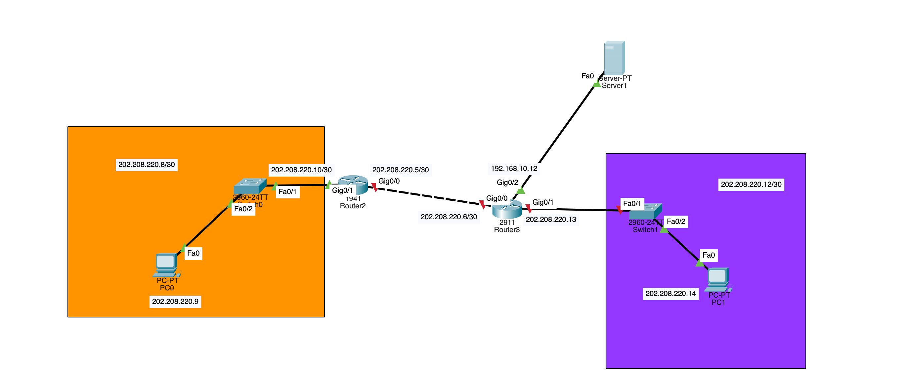

# Creating Backup 

In this session, we can create a **TFTP** server and can backup the running-config and startup-config and later we'll copy the backup after reloading the router as we'll be prforming a complete reset ofthe router where all our configuration will be gone but because we've already saved our configurations on the server, we'll be able to **restore** them.

We'll refer to the below created Network Diagram. 



### Setting-up TFTP server

- Ensure the **TFTP** server is ready first. To create a TFTP server, go to the **End Devices** and drag and drop a **Server**
- Then Go to **Service** and select **TFTP**, make sure that Service is **On**, note that below is the list of files, which are nothing but the files saved on server, thus, you can check the *saved file* by checking its name in here.
- Now you need to configure the IP address. Go to **Desktop** tab and select on **IP Configuration**, and enter the *IPv4 Address*, *Subnet Mask*, and make sure that when you connect the router and server, they share the same subnet.

In our case we've configured the server with IP *`192.168.10.13`*. After configuring the Server, you need to configure the Router. Note that we've configured the router on each interface as we've also created routing table for creating a practical scenario. So you can do that. Refer to [day6 lab](../day6/lab.md) for greater depths of understanding as we've discussed the flow of commands to configure the router.

### Backing up to TFTP

- Connect the router with the **straight-through cable**.
- Go to router and first try `ping` to server, see the router can reach the server. If it is, proceed further, if not, you need to troubleshoot.
- Use `copy running-config tftp` and Enter the *IP address* of the **tftp** server
```
Address or name of remote host []? 192.168.10.13
```
- and then enter the *filename*, if not given it will be saved as ***hostname*** followed by **-confg**.
```
Destination filename [A-confg]? 
```
You'll see the below shown result when the copy to tftp server is done.

```
Writing running-config...!!
[OK - 860 bytes]

860 bytes copied in 0.003 secs (286666 bytes/sec)
```

Now you need to reload the router but remember that the outcome we're after is that our router has gone to failure and we are required to copy the backup with all that configurations that we did, so in that case we need to reload the router without saving anything to the **startup-config**.

### Restoring from TFTP Server

Now see that our Router after the **reload** there is change of hostname as *Router*. 

- Now we need to configure the ip address on the interface **g0/2** so that we can connect to the server, so again we need to connect to the server.
- After connecting, go to router and **copy** the backup. Use `copy tftp running-confg` and enter the *ip address* of the server and give the *filename* and your backup will be initialised and configurations will be **restored**.

Given below are the following set of commands that you need to run after you reload the router.

```
Router>en
Router#conf t
Enter configuration commands, one per line.  End with CNTL/Z.
Router(config)#int g0/2
Router(config-if)#ip add 192.168.10.12 255.255.255.0
Router(config-if)#no shut

Router(config-if)#
%LINK-5-CHANGED: Interface GigabitEthernet0/2, changed state to up

%LINEPROTO-5-UPDOWN: Line protocol on Interface GigabitEthernet0/2, changed state to up

Router(config-if)#exit
Router(config)#
Router(config)#exit
Router#
%SYS-5-CONFIG_I: Configured from console by console

Router#copy tftp running-config 
Address or name of remote host []? 192.168.10.13
Source filename []? A-confg
Destination filename [running-config]? 

Accessing tftp://192.168.10.13/A-confg....
Loading A-confg from 192.168.10.13: !
[OK - 860 bytes]

860 bytes copied in 3.004 secs (286 bytes/sec)
A#
%SYS-5-CONFIG_I: Configured from console by console

A#
A#
```

After you copy the backup, you'll witness that before your router hostname was **Router** but after the copy there is a change to the previous router hostname before the reload. This means, if you check your **running-config** you'll find the previous set of configurations that were running before the reload.
